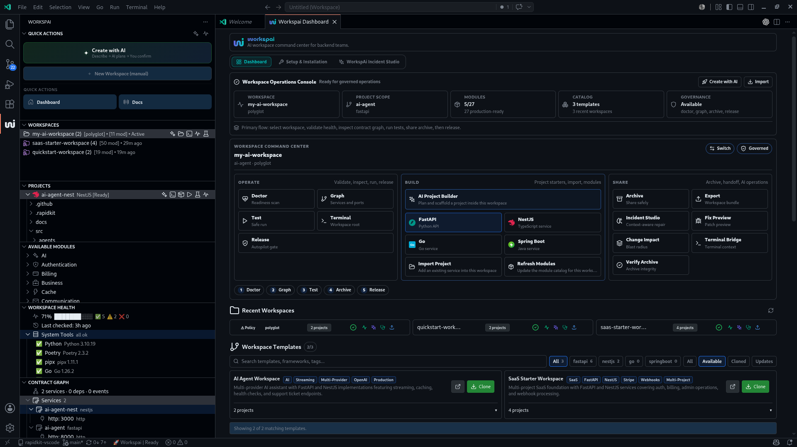
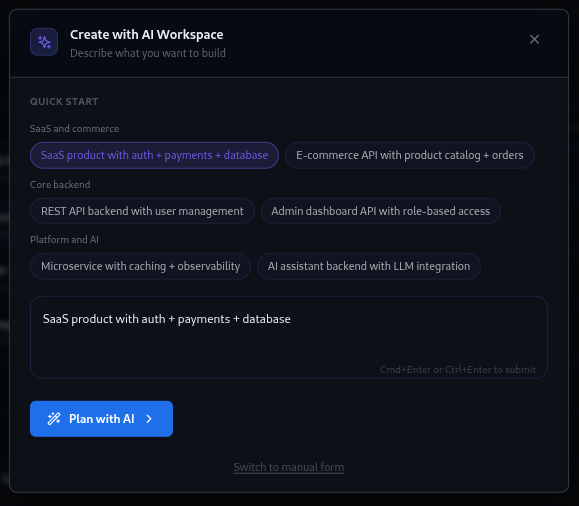
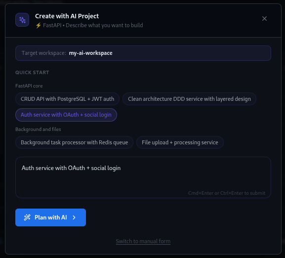
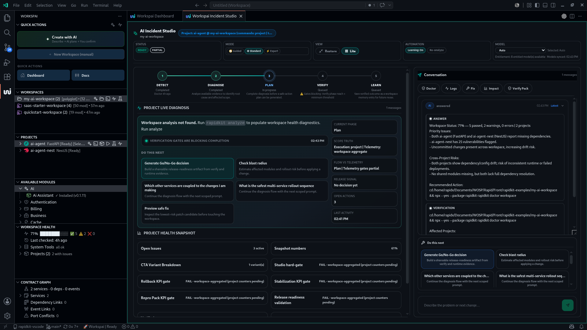
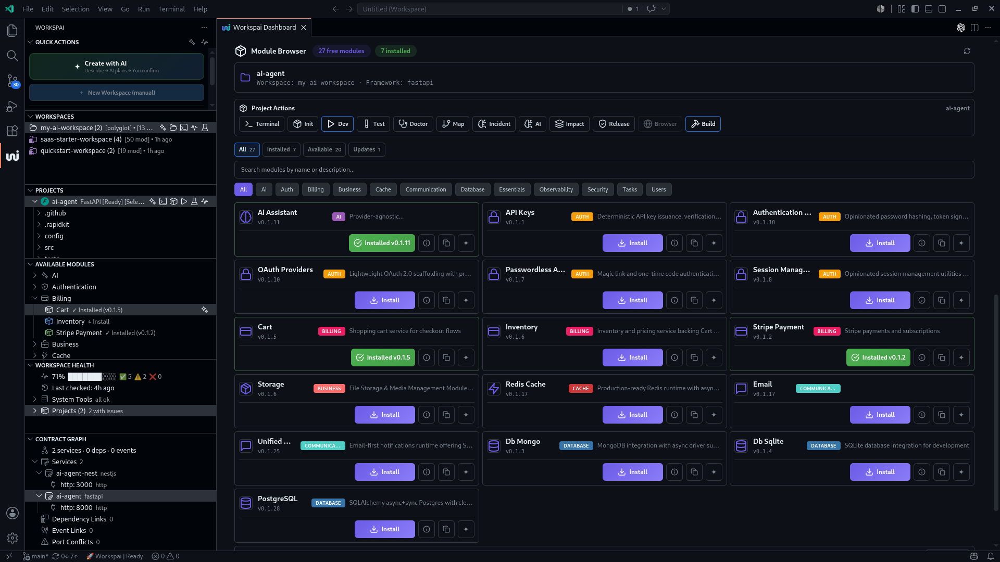
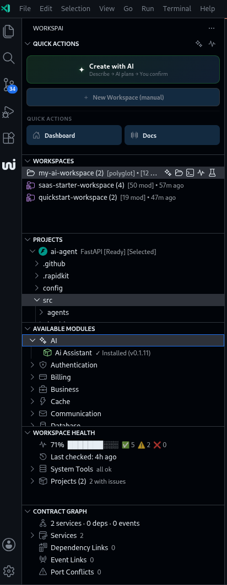
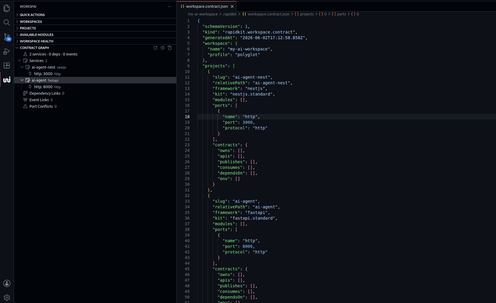
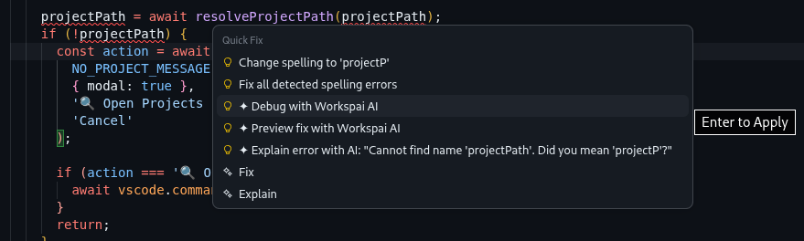

# Workspai for VS Code

<div align="center">

**The AI workspace command center for backend teams.**

Create backend workspaces, generate projects, inspect architecture, install modules, debug with context, and prepare releases without leaving VS Code.

[](https://marketplace.visualstudio.com/items?itemName=rapidkit.rapidkit-vscode)
[](https://marketplace.visualstudio.com/items?itemName=rapidkit.rapidkit-vscode)
[](https://www.npmjs.com/package/rapidkit)

[Install](https://marketplace.visualstudio.com/items?itemName=rapidkit.rapidkit-vscode) · [Docs](https://www.workspai.com/) · [Issues](https://github.com/rapidkitlabs/rapidkit-vscode/issues)

</div>

---

## Why Workspai

Workspai turns VS Code into a governed workspace surface for backend teams. It brings the RapidKit CLI, workspace-aware AI, architecture inspection, module management, and release checks into one native workbench experience.

Use it when you want to:

- Create a backend workspace from intent.
- Add FastAPI, NestJS, Go, or Spring Boot projects inside a workspace.
- Inspect services, ports, dependencies, events, and ownership.
- Install production-ready free modules into supported projects.
- Run workspace health, tests, archive verification, and release gates.
- Debug issues with AI that understands the selected workspace and project.

Supported project families:

**FastAPI** · **NestJS** · **Spring Boot** · **Go/Fiber** · **Go/Gin**

---

## Product Tour

### Workspace Command Center



The dashboard is the primary operating surface. It separates workspace-level controls from selected-workspace operations so the user always knows what will be created, imported, inspected, shared, or released.

What belongs here:

- Workspace Operations Console: create or import workspaces, view governance readiness.
- Workspace Command Center: Doctor, Graph, Test, Terminal, Release, Build, Share.
- Recent Workspaces: fast return to active work.
- Workspace Templates: searchable starter catalog.
- Module Browser: project-scoped module installation and updates.

### Create With AI



Describe the system you want. Workspai plans the workspace, chooses the right starter shape, and prepares a scaffold you can review before generation.

### Build Projects Inside A Workspace



Use AI Project Builder for intent-driven project creation, or choose a framework starter for manual creation with FastAPI, NestJS, Go, or Spring Boot.

### WorkspAI Incident Studio



Incident Studio is the workspace-aware AI repair environment. It can analyze the active workspace or selected project, review architecture and health evidence, explain failures, preview fixes, and produce a safer rollout path.

Core workflows:

- Root-cause analysis with workspace context.
- Patch preview before changing code.
- Change impact and blast-radius review.
- Terminal output diagnosis.
- Release-readiness evidence.

### Module Browser



Browse the free module catalog by status and category. Install, update, inspect, or copy install commands for the active supported project.

Module Browser includes:

- All, Installed, Available, and Updates filters.
- Category filters.
- Search.
- Installed/update states.
- Project actions for terminal, init, dev, test, browser, and build.

### Sidebar Control Plane



The sidebar keeps everyday operations close: quick actions, workspace switch, project actions, available modules, workspace health, and contract graph.

### Workspace Contract Registry



Workspai keeps workspace structure explicit through a contract registry. Services, ports, dependencies, events, and ownership metadata stay visible in the sidebar while the underlying `workspace.contract.json` remains inspectable in the editor.

### Editor Quick Fixes



Workspai also integrates with editor workflows. From diagnostics and command surfaces, you can explain errors, preview fixes, and debug with workspace context.

---

## AI Tools

Workspai AI features use GitHub Copilot models available in your VS Code environment.

| Tool | Purpose |
|------|---------|
| **Create with AI** | Plan and create a new workspace from intent |
| **AI Project Builder** | Plan and scaffold a project inside the active workspace |
| **Incident Studio** | Diagnose, explain, and repair issues with workspace context |
| **Fix Preview** | Review the smallest safe patch before changing code |
| **Change Impact** | Understand blast radius and rollout risk |
| **Terminal Bridge** | Turn terminal errors into structured diagnosis and next steps |
| **Workspace Memory** | Capture local conventions so AI answers stay aligned |

---

## Quick Start

Install the extension from the Marketplace:

https://marketplace.visualstudio.com/items?itemName=rapidkit.rapidkit-vscode

Then open the Command Palette:

```text
Workspai: Open Dashboard
Workspai: Create Workspace
Workspai: Run System Check
Workspai: Create Project
```

For CLI workflows, use the RapidKit npm package:

```bash
npx --yes --package rapidkit rapidkit doctor workspace
npx --yes --package rapidkit rapidkit init
npx --yes --package rapidkit rapidkit dev
npx --yes --package rapidkit rapidkit test
```

---

## Workspace Operations

| Surface | What it does |
|---------|--------------|
| **Doctor** | Runs workspace readiness checks |
| **Graph** | Opens service, dependency, event, and port topology |
| **Test** | Runs the selected workspace test path |
| **Archive** | Creates a shareable workspace archive |
| **Export** | Exports a workspace bundle |
| **Verify Archive** | Checks archive integrity before handoff |
| **Release** | Runs the autopilot release gate |
| **Terminal** | Opens a terminal at the workspace or project root |

---

## Frameworks

| Framework | Language | Typical use |
|-----------|----------|-------------|
| **FastAPI** | Python | Async APIs, OpenAPI docs, service backends |
| **NestJS** | TypeScript | Modular backend services with DI |
| **Spring Boot** | Java | Enterprise REST services and JVM stacks |
| **Go/Fiber** | Go | High-performance Go HTTP services |
| **Go/Gin** | Go | Lightweight Go APIs and services |

---

## Modules

The free module catalog provides production-oriented building blocks for supported project types.

Typical categories:

- AI
- Authentication
- Billing
- Business
- Cache
- Communication
- Database
- Essentials
- Observability
- Security
- Tasks
- Users

Install from the extension Module Browser or the CLI:

```bash
npx --yes --package rapidkit rapidkit add module <module-slug>
```

Module installation is currently supported for FastAPI and NestJS projects. Go, Spring Boot, and .NET projects are scaffold/import/runtime-supported, but they use their native package ecosystems instead of the RapidKit module marketplace.

---

## Requirements

| Tool | Version |
|------|---------|
| VS Code | 1.100+ |
| Node.js | 18+ |
| Python | 3.10+ for FastAPI projects |
| Go | 1.21+ for Go projects |
| Java | 17+ for Spring Boot projects |

Run `Workspai: Run System Check` to verify your local environment.

---

## Keyboard Shortcuts

| Shortcut | Action |
|----------|--------|
| `Ctrl+Shift+R Ctrl+Shift+W` | Create Workspace |
| `Ctrl+Shift+R Ctrl+Shift+P` | Create Project |
| `Ctrl+Shift+R Ctrl+Shift+M` | Add Module |
| `Ctrl+Shift+R Ctrl+Shift+D` | Debug with AI |

---

## Ecosystem

| Component | Role |
|-----------|------|
| [rapidkit-vscode](https://github.com/rapidkitlabs/rapidkit-vscode) | Workspai VS Code extension |
| [rapidkit npm CLI](https://www.npmjs.com/package/rapidkit) | Workspace and project CLI bridge |
| [rapidkit-core](https://pypi.org/project/rapidkit-core/) | Python generation engine and module runtime |
| [rapidkit-examples](https://github.com/rapidkitlabs/rapidkit-examples) | Starter and reference workspaces |

---

## Troubleshooting

**Dashboard does not refresh after changing workspace**

Run `Developer: Reload Window`, then open `Workspai: Open Dashboard`.

**Python is not found**

Install Python 3.10+, restart VS Code, then run `Workspai: Run System Check`.

**Project creation fails**

Open `View -> Output -> Workspai`, review the command output, then run `Workspai: Run System Check`.

**Workspace is not detected**

Open the workspace folder directly or import it from Workspai. Workspai expects a RapidKit workspace marker and project metadata.

**Module install is disabled**

Select a supported FastAPI or NestJS project from the Projects panel. Some module workflows are not available for Go or Spring Boot projects.

---

## Media Assets

Screenshots and Marketplace capture guidance live in [`media/README.md`](media/README.md).

---

## Links

[Documentation](https://www.workspai.com/) · [Marketplace](https://marketplace.visualstudio.com/items?itemName=rapidkit.rapidkit-vscode) · [npm](https://www.npmjs.com/package/rapidkit) · [PyPI](https://pypi.org/project/rapidkit-core/) · [Issues](https://github.com/rapidkitlabs/rapidkit-vscode/issues) · [Changelog](CHANGELOG.md)

---

MIT © [Workspai](https://www.workspai.com)
