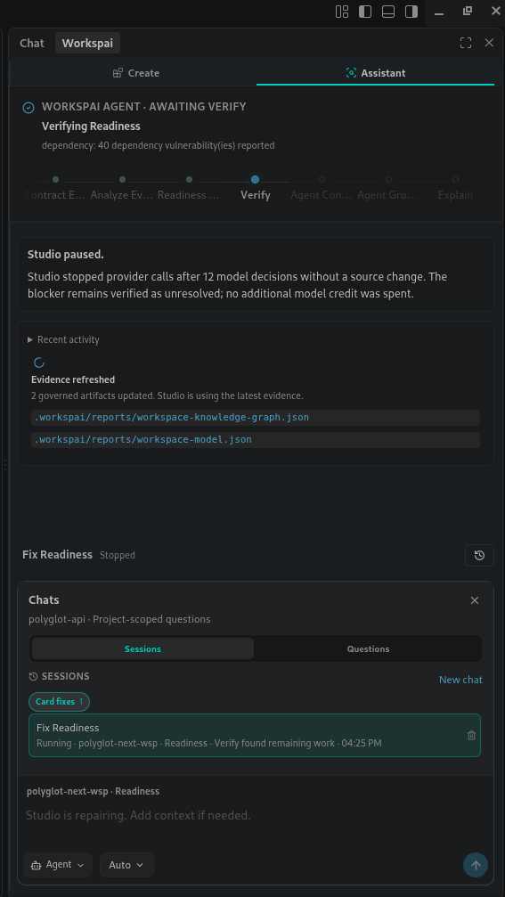
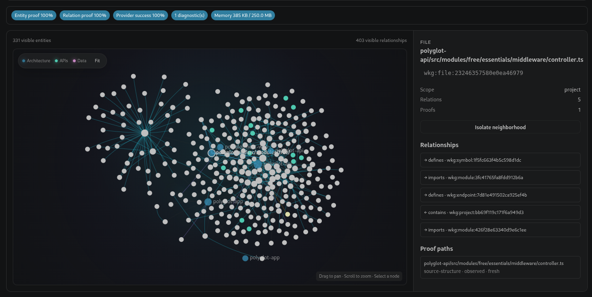

# Workspai for VS Code

<div align="center">


### Understand the workspace. Change it with evidence. Verify the result.

Workspai gives developers and AI agents one shared view of the code, projects,
contracts, dependencies, and operational evidence that make up a software system.

[](https://marketplace.visualstudio.com/items?itemName=rapidkit.rapidkit-vscode)
[](https://marketplace.visualstudio.com/items?itemName=rapidkit.rapidkit-vscode)
[](LICENSE)

[Install extension](https://marketplace.visualstudio.com/items?itemName=rapidkit.rapidkit-vscode)
· [Read the docs](https://www.workspai.dev/)
· [View source](https://github.com/chistiq/rapidkit-vscode)

</div>

<p align="center">
  
</p>

<p align="center">
  <strong>Ask → inspect → change → test → verify</strong>
</p>

## One assistant, three ways to work

| Mode      | Use it when you want Workspai to…                                       |
| --------- | ----------------------------------------------------------------------- |
| **Ask**   | Explain the workspace using source, diagnostics, changes, and evidence. |
| **Plan**  | Investigate a task and prepare a grounded implementation plan.          |
| **Agent** | Edit code, run scoped checks, review the diff, and verify the result.   |

Agent works for ordinary engineering tasks as well as dashboard blockers. It
does not need an incident card to inspect and improve code. Existing files must
be read before they are changed, writes are transaction-backed, and completion
requires verification.

## Why Workspai

- **The whole system, not one file** — connect projects, services, contracts,
  infrastructure, documentation, and evidence across a polyglot workspace.
- **Less context guessing** — give humans and agents focused, traceable workspace
  context instead of repeatedly loading an entire repository.
- **Changes you can verify** — inspect diagnostics and diffs, apply guarded
  patches, run project checks, and return the result to shared workspace evidence.

## Explore the workspace graph

See how projects, modules, files, APIs, and dependencies connect across the
workspace. Select any entity to inspect its relationships and the evidence that
supports them.

<p align="center">
  
</p>

## Bring your model

Use models already available through VS Code, run locally, or connect with your
own provider key.

`VS Code Models` · `OpenAI` · `Claude` · `Gemini` · `Kimi` · `DeepSeek` ·
`OpenRouter` · `Groq` · `Mistral` · `xAI` · `Ollama` · `Custom`

Provider credentials are isolated in VS Code Secret Storage. Endpoint and model
preferences are stored separately for each provider.

## Start in minutes

1. [Install Workspai from the Marketplace](https://marketplace.visualstudio.com/items?itemName=rapidkit.rapidkit-vscode).
2. Install or update the canonical CLI:

   ```bash
   npm install -g workspai@latest
   ```

3. Open **Workspai: Open Dashboard**, select or adopt a workspace, then open the
   Assistant and choose **Ask**, **Plan**, or **Agent**.

Workspai supports FastAPI, NestJS, Next.js, Vite, Angular, Go, Spring Boot,
.NET, adopted repositories, and other mixed-stack workspaces. Deep module
generation remains available for FastAPI and NestJS; Workspace Intelligence
works across the complete workspace.

## Learn more

- [Workspai documentation](https://www.workspai.dev/)
- [Workspai platform](https://www.workspai.com/)
- [CLI on npm](https://www.npmjs.com/package/workspai)
- [Changelog](CHANGELOG.md)
- [Contributing](CONTRIBUTING.md)
- [Issues and feature requests](https://github.com/chistiq/rapidkit-vscode/issues)

MIT © [Chistiq](https://github.com/chistiq)
