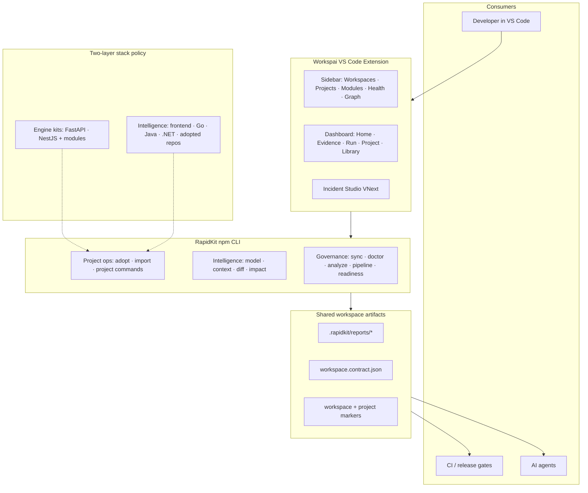
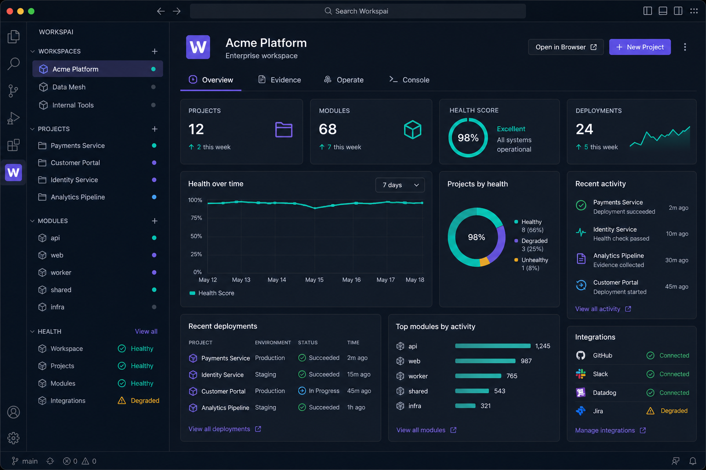
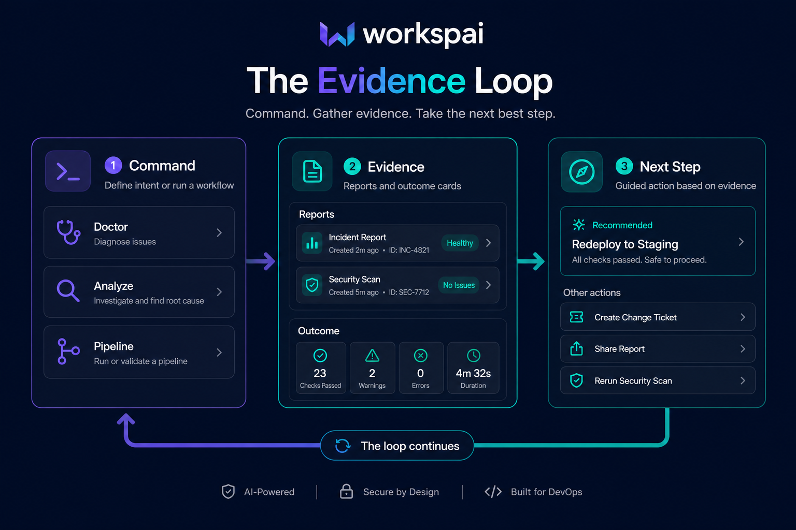
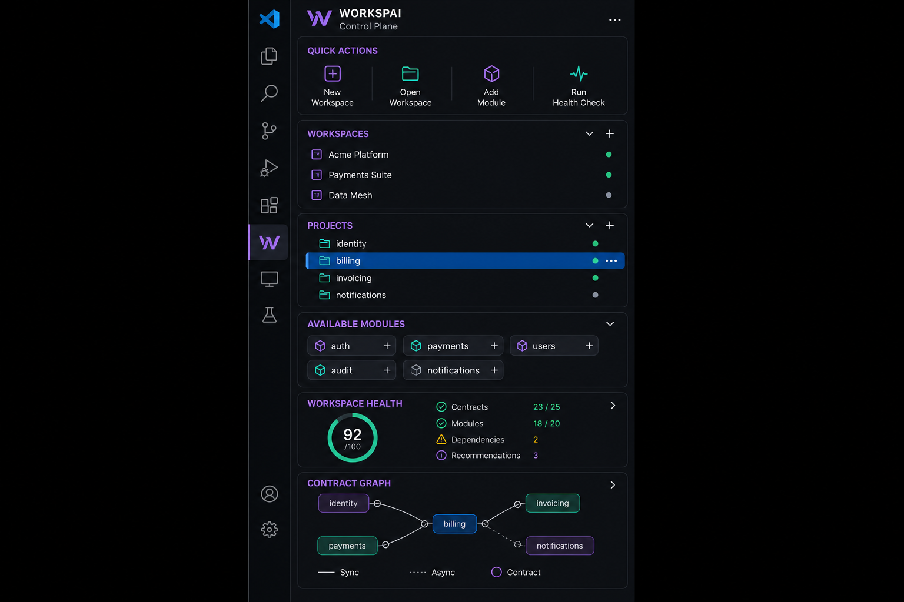

# Workspai for VS Code

<div align="center">

### Workspace Intelligence for VS Code

One workspace. One truth. Humans and AI aligned.

Workspai is the VS Code surface for RapidKit, making shared workspace understanding visible and actionable inside the IDE.

[](https://marketplace.visualstudio.com/items?itemName=rapidkit.rapidkit-vscode)
[](https://marketplace.visualstudio.com/items?itemName=rapidkit.rapidkit-vscode)
[](https://www.npmjs.com/package/rapidkit)

[Install](https://marketplace.visualstudio.com/items?itemName=rapidkit.rapidkit-vscode) · [Docs](https://www.workspai.com/) · [Changelog](CHANGELOG.md) · [Issues](https://github.com/rapidkitlabs/rapidkit-vscode/issues)

</div>

---

## At a glance

Workspai is the VS Code surface for RapidKit workspace intelligence.

The name comes from Workspace + Intelligence: the IDE surface where RapidKit's shared workspace understanding becomes visible and actionable.

Instead of treating AI as a file-level assistant, Workspai operates on the workspace itself — projects, dependencies, architecture, operational context, evidence, and release readiness.

Developers, CI pipelines, IDEs, and AI agents all work from the same workspace model and shared source of truth.

Workspai supports:

* Backend services
* Frontend applications
* Imported repositories
* Polyglot workspaces
* Workspace-aware AI workflows

| You get                    | Why it matters                                                                               |
| -------------------------- | -------------------------------------------------------------------------------------------- |
| **Workspace intelligence** | Model, context, diff, impact, and verification operate on the entire workspace               |
| **Enterprise dashboard**   | Home, Evidence, Run, Project, and Library surfaces with contextual actions                   |
| **Evidence loop**          | Commands generate evidence and recommended next steps                                        |
| **Sidebar control plane**  | Workspaces, projects, modules, health, contracts, and operational state                      |
| **Incident Studio**        | Workspace-aware diagnosis, repair workflows, and change validation                           |
| **Canonical CLI bridge**   | Delegates to `npx rapidkit` for adoption, creation, lifecycle, governance, and CI operations |


### The two-layer model

RapidKit does **not** pretend every framework is a native kit. The product strategy is:

```text
First-class engine kits  →  FastAPI and NestJS (modules + deep generation)
Workspace Intelligence   →  every other stack you already have
```

That means Next.js, Vite, Angular, Go, Spring Boot, .NET, and adopted repos are **first-class workspace citizens** — observable, governable, and agent-ready — even when they use their native package ecosystems instead of the RapidKit module marketplace.



---

## Product surfaces

### Enterprise dashboard

<p align="center">
  
</p>

The dashboard is the primary operating surface for v0.35+:

- **Home** — workspace summary, onboarding, and quick orientation
- **Evidence** — doctor, analyze, pipeline, readiness, and release artifacts
- **Run** — workspace governance, cheatsheet, intelligence, and workspace-level commands
- **Project** — project actions, module browser, and capability-aware controls
- **Library** — recent workspaces, starter templates, and module catalog browse

Commands dispatch through contract-aware bridges so the UI only offers actions the active workspace or project actually supports.

### Evidence loop

<p align="center">
  
</p>

Workspai closes the ops loop inside the IDE:

1. Run a governed command (`doctor`, `analyze`, `pipeline`, archive, release, …)
2. Read structured evidence from `.rapidkit/reports/*`
3. Review outcomes and open the safest next command from the dashboard or Incident Studio

### Sidebar control plane

<p align="center">
  
</p>

Everyday operations stay one click away:

| Panel | Purpose |
|-------|---------|
| **Quick Actions** | Minimal command launcher for `Dashboard / Create / Advisor / Studio / Doctor` |
| **Workspai** | AI sidebar with `Create with AI / Workspace Advisor / Studio` tabs, including a live creation timeline, architecture prompts, and Studio handoff |
| **Workspaces** | Switch and manage RapidKit workspaces |
| **Projects** | Select a project; lifecycle menus respect CLI capabilities |
| **Available Modules** | Browse and install modules for supported backends |
| **Workspace Health** | Doctor evidence without an extra CLI call |
| **Contract Graph** | Services, ports, dependencies, events, and ownership |

### Incident Studio VNext

<p align="center">
  
</p>

Incident Studio is the workspace-aware AI repair environment:

- Root-cause analysis with scoped workspace/project context
- Fix preview before mutating code
- Ship loop: analyze → verify-gates → readiness → archive → autopilot-release
- CLI surface with allowlisted RapidKit commands and mutation gates
- Terminal bridge for structured diagnosis from real command output

---

## Stacks, kits, and module policy

Workspai supports the same polyglot surface as the RapidKit CLI:

| Layer | Stacks | What you get |
|-------|--------|--------------|
| **Engine kits + modules** | FastAPI, NestJS | Scaffold, lifecycle, RapidKit module marketplace |
| **Backend intelligence** | Spring Boot, Go (Fiber/Gin), .NET, Express, Django, and more | Adopt, import, detect, lifecycle, evidence, agent context |
| **Frontend intelligence** | Next.js, Remix, Vite (React/Vue/Svelte/Solid), Nuxt, Angular, Astro, SvelteKit | Official generators, adopt/import, workspace model, evidence, agent context |

RapidKit modules remain Core-backed templates for **FastAPI** and **NestJS** only. Frontend and extended backend stacks are fully supported through **Workspace Intelligence** — not through pretending they share the same module runtime.

Capability gating is driven by the canonical CLI:

```bash
npx rapidkit project commands --json
npx rapidkit workspace model --json
npx rapidkit workspace context --for-agent --json
```

The extension uses those surfaces for dashboard buttons, sidebar menus, module install guards, and AI context.

---

## Quick start

### 1. Install

[Install from the Marketplace](https://marketplace.visualstudio.com/items?itemName=rapidkit.rapidkit-vscode), then reload VS Code.

### 2. Open the dashboard

```text
Workspai: Open Dashboard
```

### 3. Create or import a workspace

```text
Workspai: Create Workspace
Workspai: Import Workspace
```

### 4. Add a project

```text
Workspai: Create Project
```

Or adopt an existing repo into the active workspace:

```text
Workspai: Adopt Project
```

### 5. Verify the environment

```text
Workspai: Run System Check
```

### CLI equivalents

```bash
npx rapidkit doctor workspace
npx rapidkit init
npx rapidkit dev
npx rapidkit test
npx rapidkit pipeline --json --strict
npx rapidkit add module <module-slug>   # FastAPI / NestJS only
```

---

## AI tools

Workspai AI features use the language models available in your VS Code environment (for example GitHub Copilot models where enabled).

| Tool | Purpose |
|------|---------|
| **Create with AI** | Plan and create a workspace from intent |
| **AI Project Builder** | Scaffold a project inside the active workspace |
| **Incident Studio** | Diagnose, explain, and repair with scoped evidence |
| **Fix Preview** | Review the smallest safe patch before applying changes |
| **Change Impact** | Understand blast radius and rollout risk |
| **Terminal Bridge** | Turn terminal failures into structured next steps |
| **Workspace Memory** | Keep local conventions aligned across AI answers |

---

## Workspace operations

| Surface | What it does |
|---------|--------------|
| **Doctor** | Workspace and project readiness checks |
| **Graph** | Service, dependency, event, and port topology |
| **Analyze** | Architecture and health analysis with scoped reports |
| **Pipeline** | Governance pipeline with strict JSON verdict |
| **Test** | Run the selected workspace/project test path |
| **Archive / Export** | Package a workspace for handoff |
| **Verify Archive** | Integrity check before sharing |
| **Release** | Autopilot release gate and readiness evidence |
| **Terminal** | Open a terminal at workspace or project root |

---

## Keyboard shortcuts

| Shortcut | Action |
|----------|--------|
| `Ctrl+Shift+R Ctrl+Shift+W` | Create Workspace |
| `Ctrl+Shift+R Ctrl+Shift+P` | Create Project |
| `Ctrl+Shift+R Ctrl+Shift+M` | Add Module |
| `Ctrl+Shift+R Ctrl+Shift+D` | Debug with AI |

---

## Requirements

| Tool | Version |
|------|---------|
| VS Code | 1.100+ |
| Node.js | 18+ |
| Python | 3.10+ for FastAPI projects |
| Go | 1.21+ for Go projects |
| Java | 17+ for Spring Boot projects |

Run `Workspai: Run System Check` to verify local tooling.

---

## Ecosystem

| Component | Role |
|-----------|------|
| [rapidkit-vscode](https://github.com/rapidkitlabs/rapidkit-vscode) | Workspai VS Code extension |
| [rapidkit npm CLI](https://www.npmjs.com/package/rapidkit) | Workspace and project CLI bridge |
| [rapidkit-core](https://pypi.org/project/rapidkit-core/) | Python generation engine and module runtime |
| [rapidkit-examples](https://github.com/rapidkitlabs/rapidkit-examples) | Starter and reference workspaces |

---

## Troubleshooting

**Extension sidebar is empty or a panel says “no data provider”**

Run `npm run compile` if you are developing locally, then `Developer: Reload Window`. Check `Output → Log (Extension Host)` for activation errors.

**Project list flickers or selection resets after choosing a workspace**

Update to the latest build — workspace selection now deduplicates refresh and preserves project selection state.

**Dashboard does not refresh after changing workspace**

Run `Developer: Reload Window`, then `Workspai: Open Dashboard`.

**Module install is disabled**

Select a FastAPI or NestJS project in the Projects panel. Frontend and extended backend kits do not use the RapidKit module marketplace.

**Project creation or adopt fails**

Open `View → Output → Workspai`, inspect the command output, then run `Workspai: Run System Check`.

---

## Media assets

README illustrations live in [`media/readme/`](media/readme/). Marketplace capture guidance and real screenshot rules live in [`media/README.md`](media/README.md).

- README images are **current product mockups** aligned with the v0.35 design system.
- Marketplace hero screenshots should still be **real VS Code captures** once you recapture the latest dashboard and sidebar after local smoke testing.

---

## Links

[Documentation](https://www.workspai.com/) · [Marketplace](https://marketplace.visualstudio.com/items?itemName=rapidkit.rapidkit-vscode) · [npm](https://www.npmjs.com/package/rapidkit) · [PyPI](https://pypi.org/project/rapidkit-core/) · [Issues](https://github.com/rapidkitlabs/rapidkit-vscode/issues) · [Changelog](CHANGELOG.md)

---

MIT © [Workspai](https://www.workspai.com)
